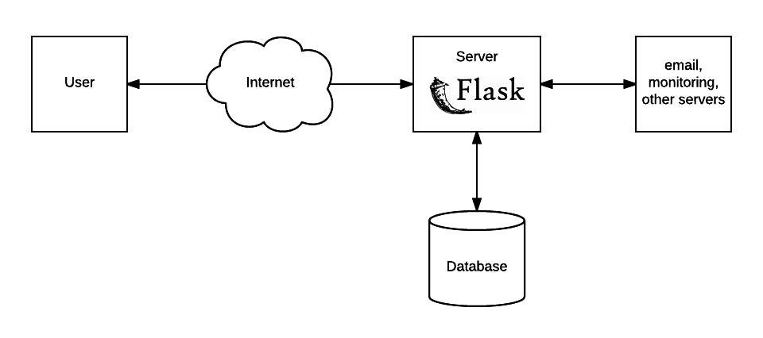

# Flask basics / what is a web application?



A web application is a computer system accessible through the web.

Clients such as ourselves request information from the app and the server retrieves it for us, often from a database.

Clients can also introduce new information that the server keeps track of.

# Flask Intro

Flask is a 3rd-party package, so we have to install it with pip.

To keep 3rd-party package installations clean, we'll use a virtual environment.

```sh
$ pip install virtualenv
Collecting virtualenv
  Using cached virtualenv-15.1.0-py2.py3-none-any.whl
Installing collected packages: virtualenv
Successfully installed virtualenv-15.1.0
$ virtualenv venv
Using base prefix '/usr/local/Cellar/python3/3.6.3/Frameworks/Python.framework/Versions/3.6'
New python executable in /Users/razzi/forks/PyClassLessons/venv/bin/python3.6
Also creating executable in /Users/razzi/forks/PyClassLessons/venv/bin/python
Installing setuptools, pip, wheel...done.
$ source venv/bin/activate
(venv) $
```

Now we can install Flask.

```sh
$ pip install flask
pip install flask
Collecting flask
  Downloading Flask-0.12.2-py2.py3-none-any.whl (83kB)
    100% |████████████████████████████████| 92kB 500kB/s
Collecting Jinja2>=2.4 (from flask)
  Using cached Jinja2-2.9.6-py2.py3-none-any.whl
Collecting click>=2.0 (from flask)
  Using cached click-6.7-py2.py3-none-any.whl
Collecting itsdangerous>=0.21 (from flask)
Collecting Werkzeug>=0.7 (from flask)
  Downloading Werkzeug-0.12.2-py2.py3-none-any.whl (312kB)
    100% |████████████████████████████████| 317kB 821kB/s
Collecting MarkupSafe>=0.23 (from Jinja2>=2.4->flask)
Installing collected packages: MarkupSafe, Jinja2, click, itsdangerous, Werkzeug, flask
Successfully installed Jinja2-2.9.6 MarkupSafe-1.0 Werkzeug-0.12.2 click-6.7 flask-0.12.2 itsdangerous-0.24
$ flask
Usage: flask [OPTIONS] COMMAND [ARGS]...
...
```

# Hello World in Flask

Straight from the website flask.org:

```python
from flask import Flask
app = Flask(__name__)

@app.route("/")
def hello():
    return "Hello World!"
```

# Development flow

Set FLASK_DEBUG=1 to enable automatic reloading.

# Realistic application

We'll make a guestbook, where users can record their names.
